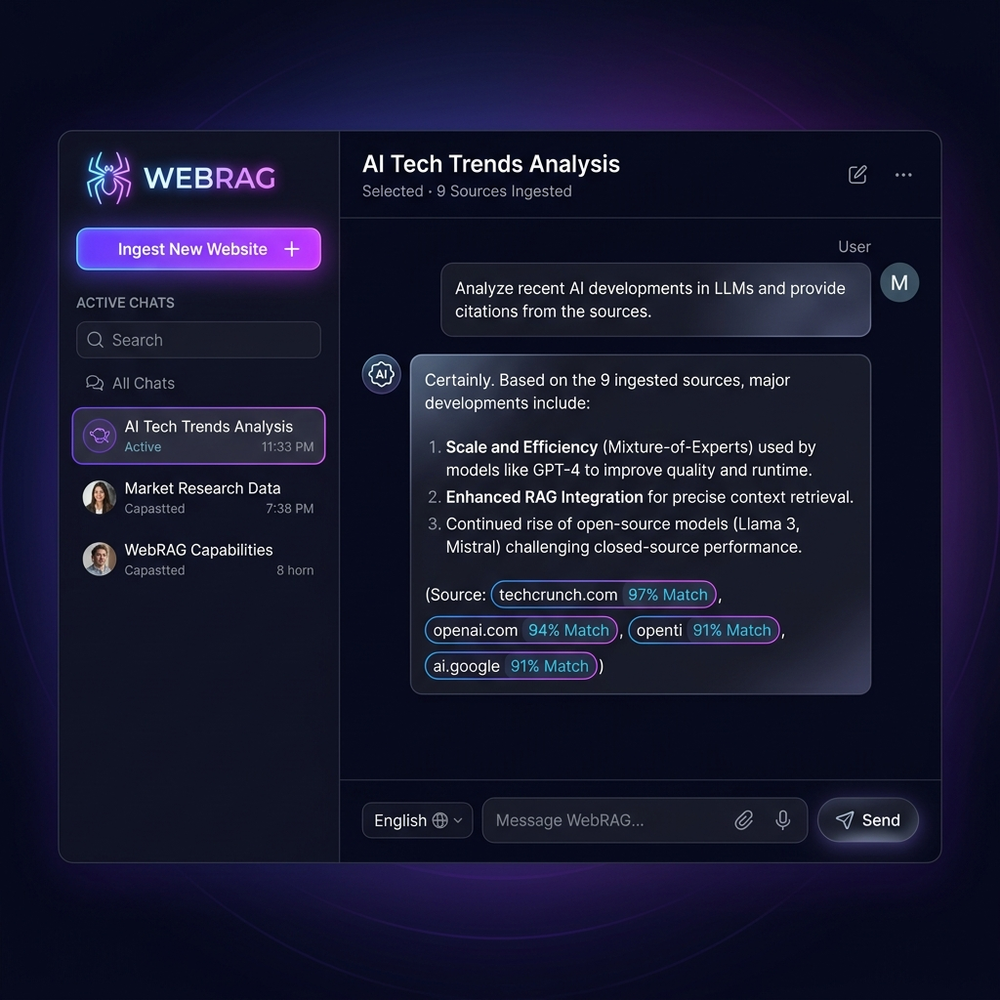
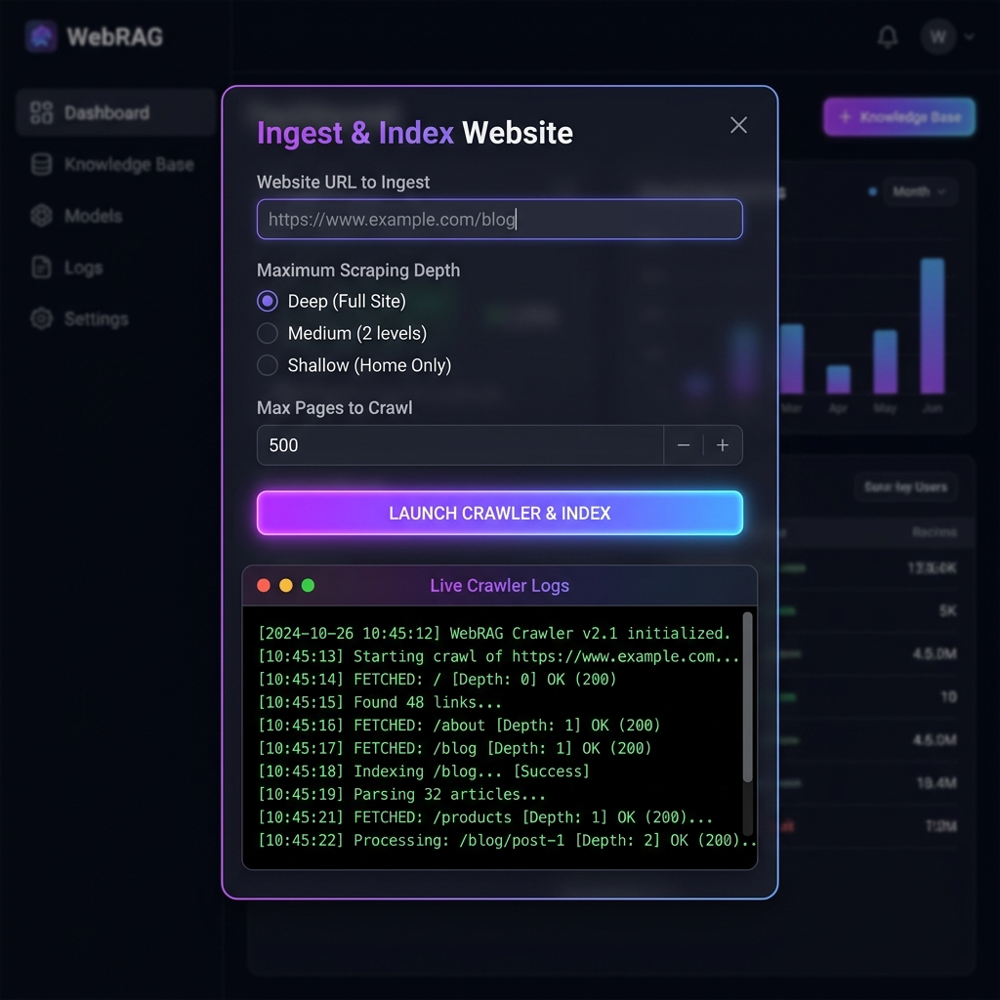
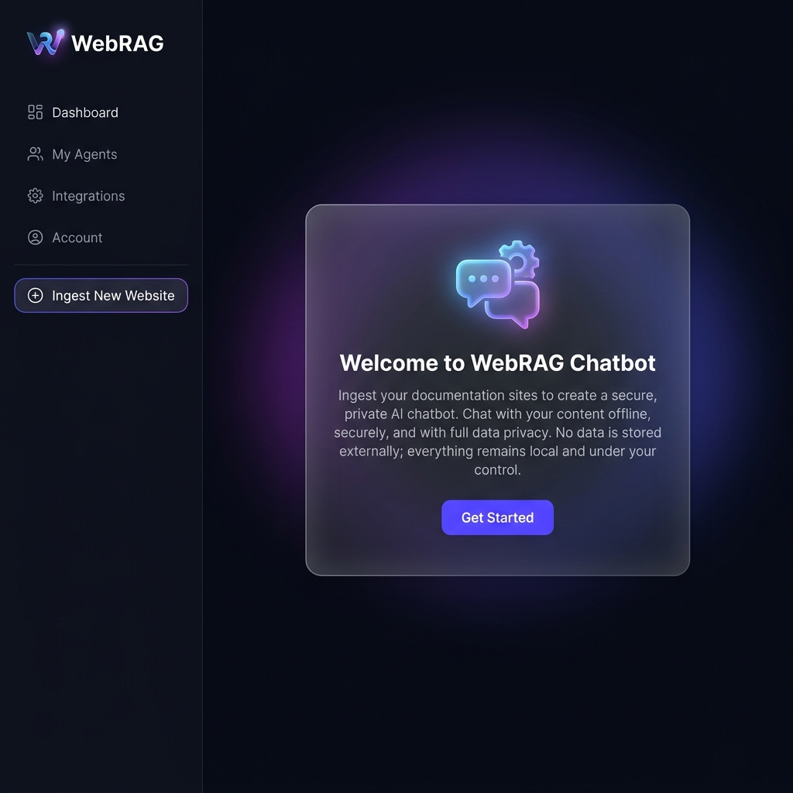

# 🕸️ WebRAG: Premium Local Offline RAG-Powered Website Chatbot

WebRAG is a state-of-the-art, high-performance RAG (Retrieval-Augmented Generation) website chatbot. It crawls and ingests any given website URL, recursively scrapes sub-pages under the same domain, indexes the content chunks into a local **FAISS** vector database, and streams answers using a local **Qwen-2.5-1.5B-Instruct** model with sub-second latency.

Because it runs local open-source models, the system is **100% free, runs entirely offline, and respects data privacy**—no user queries or scraped details are ever transmitted to third-party APIs.

---

## 📋 Table of Contents

1. [Project Overview](#-project-overview)
2. [Architecture](#-architecture)
3. [Tech Stack](#-tech-stack)
4. [Feature Summary](#-feature-summary)
5. [Project Structure](#-project-structure)
6. [Setup & Installation](#-setup--installation)
7. [Environment Variables / Configuration](#-environment-variables--configuration)
8. [Running the Application](#-running-the-application)
9. [Database Schema](#-database-schema)
10. [Feature Screenshots](#-feature-screenshots)

---

## 🔍 Project Overview

WebRAG provides a comprehensive local pipeline that lets users input a URL, monitor the real-time crawling status through a terminal console, and immediately chat with the ingested knowledge base. Designed with a premium dark neon glassmorphic user interface, it combines modern web technology with local AI to ensure enterprise-grade security, lightning-fast offline queries, and dynamic multi-language support.

---

## 🏗️ Architecture

Below is the conceptual ASCII block diagram showing the data ingestion and query execution pipelines within the application:

```text
┌─────────────────────────────────────────────────────────────┐
│                   Glassmorphic Web UI                       │
│        (Sidebar sessions | Chat window | Ingest modal)      │
└──────────────────────────────┬──────────────────────────────┘
                               │ HTTP / SSE Stream
┌──────────────────────────────▼──────────────────────────────┐
│                    FastAPI Backend Router                   │
│  ┌──────────────────┐  ┌──────────────────┐  ┌────────────┐  │
│  │   scraper.py     │  │ vector_store.py  │  │ db.py      │  │
│  │ (Async crawler)  │  │   (FAISS CPU)    │  │ (SQLite3)  │  │
│  └──────────────────┘  └──────────────────┘  └────────────┘  │
└──────────────────────────────┬──────────────────────────────┘
                               │
         ┌─────────────────────┼─────────────────────┐
         │                     │                     │
  ┌──────▼──────┐       ┌──────▼──────┐       ┌──────▼──────┐
  │ SQLite DB   │       │ FAISS Index │       │  Local LLM  │
  │ chatbot.db  │       │ (faiss.index│       │  Qwen-2.5-  │
  │ (History,   │       │ + metadata) │       │1.5B-Instruct│
  │ sessions)   │       └─────────────┘       └─────────────┘
  └─────────────┘
```

1. **Ingestion Flow**: The async scraper crawls pages dynamically, processes raw text into chunks, computes embeddings with SentenceTransformers, and saves them to a CPU-optimized FAISS index.
2. **Retrieval & Chat Flow**: Queries are processed (and translated back and forth if in non-English), context chunks are retrieved via semantic similarity, and the local Qwen model streams answers through FastAPI Server-Sent Events (SSE).

---

## 🛠️ Tech Stack

| Category | Technology | Description |
| :--- | :--- | :--- |
| **Frontend** | HTML5, Vanilla CSS3, Async JS | Styled with custom neon HSL gradients, glassmorphism, and responsive layout. Supports streaming responses. |
| **Backend Framework** | FastAPI + Uvicorn | High-performance asynchronous Python web framework for low-latency router handling and Server-Sent Events (SSE). |
| **Recursive Scraper** | HTTPX + BeautifulSoup4 | Asynchronous web crawler that dynamically explores sub-pages while filtering out boilerplates. |
| **Embeddings Model** | `all-MiniLM-L6-v2` | SentenceTransformer model mapping text chunks to 384-dimensional dense vectors. |
| **Vector Search** | FAISS (`faiss-cpu`) | Highly optimized indexing library for CPU-bound similarity searches. |
| **LLM Engine** | `Qwen-2.5-1.5B-Instruct` | Local state-of-the-art conversational model using HuggingFace `transformers`. |
| **Translation Pipeline**| `NLLB-200-distilled-600M` | Machine translation engine matching foreign languages (Hindi, Tamil, Japanese, French, etc.). |
| **Relational Database** | SQLite3 | Relational engine for users, logs, ratings, and system dashboard statistics. |

---

## ✨ Feature Summary

| Feature | Description | Key Components |
| :--- | :--- | :--- |
| **Asynchronous Crawling** | Recursively crawls site structures to a custom depth and page limit. | `AsyncWebScraper` in `scraper.py` |
| **100% Offline Execution** | Performs embeddings, search, and LLM text generation locally. No internet required after model cache. | HuggingFace, FAISS CPU |
| **SSE Token Streaming** | Response text is yielded token-by-token for sub-second visual responsiveness. | FastAPI `StreamingResponse` |
| **Translation Engine** | Lets users query and read answers in foreign languages. | Meta NLLB-200 Pipeline |
| **Source Citation Chips** | Renders exact sources and Cosine Similarity percentages (e.g. `96% Match`) in the chat window. | FAISS Inner Product Retrieval |
| **Lockout Security Policy** | Blocks brute force attacks by locking users for 15 minutes after 5 consecutive failed logins. | `database.py` User Schema, bcrypt |
| **Admin System Dashboard**| Detailed KPI counts, language popularity, models charts, and exports. | Plotly.js, CSV logs generator |

---

## 📂 Project Structure

```text
rag-website-chatbot/
├── assets/
│   └── images/
│       ├── empty_welcome_state.png
│       ├── main_chat_interface.png
│       └── website_ingestion_modal.png
├── backend/
│   ├── __pycache__/
│   ├── config.py
│   ├── database.py
│   ├── main.py
│   ├── requirements.txt
│   ├── scraper.py
│   ├── translator.py
│   └── vector_store.py
├── frontend/
│   ├── css/
│   │   └── style.css
│   ├── js/
│   │   └── app.js
│   └── index.html
├── .env
├── .env.template
├── .gitignore
├── Dockerfile
├── docker-compose.yml
└── chatbot.db
```

---

## ⚙️ Setup & Installation

### Option A: Local Run (Bare Metal)

#### 1. Configure the Virtual Environment
Create and activate your Python virtual environment inside the repository:
```bash
# Windows
python -m venv venv
venv\Scripts\activate

# macOS / Linux
python -m venv venv
source venv/bin/activate
```

#### 2. Install Python Packages
```bash
pip install -r backend/requirements.txt
```

---

### Option B: Containerized Run (Docker)

#### Docker Deployment
**Goal**: Containerize the application for portable, reproducible deployment.

#### What Was Done
- Created a Dockerfile defining the Python environment and dependencies
- Built a Docker image from the project directory
- Ran the FastAPI application inside a Docker container

#### Quick Docker Commands
```bash
# Build the image
docker build -t webrag .

# Run the container (maps container port 8000 to host port 8000)
docker run -p 8000:8000 webrag
```

#### Sample Dockerfile
```dockerfile
FROM python:3.12-slim

WORKDIR /app

COPY requirements.txt .
RUN pip install --no-cache-dir -r requirements.txt

COPY . .

EXPOSE 8000

CMD ["python", "-m", "backend.main"]
```

---

## 🔑 Environment Variables / Configuration

Copy the template env file to set configuration settings:
```bash
cp .env.template .env
```

The application uses the following config keys:
- `HOST`: Server bind address (Default: `0.0.0.0`)
- `PORT`: Port the FastAPI app runs on (Default: `8000`)
- `DATABASE_URL`: Location URI for SQLite3 (Default: `sqlite:///./chatbot.db`)
- `VECTOR_DB_PATH`: Folder mapping the FAISS index (Default: `./faiss_index`)

---

## 🚀 Running the Application

### On Google Colab
To run the project on Google Colab (using hardware acceleration like a T4 GPU):
1. Open a new notebook in Google Colab and select the **T4 GPU** runtime (`Runtime` -> `Change runtime type`).
2. Set any environment variables if needed (e.g. `JWT_SECRET` via the Secrets panel).
3. Run the following cells in order:
   - **Mount Google Drive**:
     ```python
     from google.colab import drive
     drive.mount('/content/drive')
     ```
   - **Clone the repository & install dependencies**:
     ```python
     !git clone https://github.com/mohammedarshath17/rag-website-chatbot.git
     %cd rag-website-chatbot
     !pip install -r backend/requirements.txt
     ```
   - **Run the FastAPI application**:
     ```python
     !python -m backend.main
     ```
   - **Expose application port 8000 via ngrok**:
     Expose port `8000` via ngrok or a similar local tunnel to get a public URL for access.

### On Local Machine / Docker

#### 1. Clone the Repo
```bash
git clone https://github.com/mohammedarshath17/rag-website-chatbot.git
cd rag-website-chatbot
```

#### 2. Set Environment Variables
Copy `.env.template` to `.env` and adjust settings:
```bash
# Linux / macOS / PowerShell
cp .env.template .env

# Windows (cmd)
copy .env.template .env
```
Or export them in your terminal:
```bash
export HOST="0.0.0.0"
export PORT="8000"
export DATABASE_URL="sqlite:///./chatbot.db"
export VECTOR_DB_PATH="./faiss_index"
```

#### 3. Run Directly (Local Machine)
Ensure Python dependencies are installed and start the FastAPI server:
```bash
python -m backend.main
```

#### 4. Run via Docker
```bash
# Build the image
docker build -t webrag .

# Run the container (maps container port 8000 to host port 8000)
docker run -p 8000:8000 \
  -e HOST="0.0.0.0" \
  -e PORT="8000" \
  -v ./models_cache:/app/models_cache \
  -v ./chatbot.db:/app/chatbot.db \
  -v ./faiss_index:/app/faiss_index \
  webrag
```

Open **`http://localhost:8000/`** in your browser.

- **Default Administrator Credentials**: `admin@webrag.com` / `AdminPassword123!`
- **Interactive OpenAPI Specification (Swagger Docs)**: `http://localhost:8000/docs`

---

## 💾 Database Schema

The SQLite3 database maintains application state, user configurations, and logs using the following schema details:

### 1. `chat_sessions`
Stores metadata representing distinct chatbot sessions.

| Column | Type | Constraints | Description |
| :--- | :--- | :--- | :--- |
| `session_id` | `TEXT` | `PRIMARY KEY` | Unique string identifier for the session (UUID format). |
| `url` | `TEXT` | - | The target domain or website URL crawled in this session. |
| `user_email` | `TEXT` | - | Owner email address mapping this session to a specific user. |
| `created_at` | `TEXT` | `NOT NULL` | ISO 8601 string timestamp recording when the session was created. |

### 2. `chat_history`
Houses individual messages from users and responses from the local assistant.

| Column | Type | Constraints | Description |
| :--- | :--- | :--- | :--- |
| `id` | `INTEGER` | `PRIMARY KEY AUTOINCREMENT` | Auto-incrementing numeric key. |
| `session_id` | `TEXT` | `NOT NULL`, `FOREIGN KEY` | Refers to `chat_sessions(session_id)` with `ON DELETE CASCADE`. |
| `role` | `TEXT` | `NOT NULL` | Sender role: `'user'` or `'assistant'`. |
| `content` | `TEXT` | `NOT NULL` | Text content of the bubble, support markdown notation. |
| `created_at` | `TEXT` | `NOT NULL` | ISO 8601 string recording message dispatch. |

### 3. `crawled_pages`
Stores individual pages crawled, indexing statistics, and parsing metadata.

| Column | Type | Constraints | Description |
| :--- | :--- | :--- | :--- |
| `url` | `TEXT` | `PRIMARY KEY` | The exact URL string matching the crawled page. |
| `title` | `TEXT` | - | Extracted `<title>` element from the web page header. |
| `word_count` | `INTEGER`| - | Total words processed and mapped to the vector store index. |
| `scraped_at` | `TEXT` | `NOT NULL` | ISO 8601 timestamp logging scrape completion. |

---

## 📸 Feature Screenshots

Below is the premium gallery showcasing the responsive interfaces and dark neon visual system:

### 1. Main Chat Interface
Provides dynamic chat bubbles, scroll automation, translation language dropdowns, and highlighted source citation chips.


### 2. Website Ingestion Modal
Features deep recursive site scraper parameters and the integrated dark log terminal.


### 3. Empty Welcome State
An elegant starting landing card guiding users to begin page crawls.

